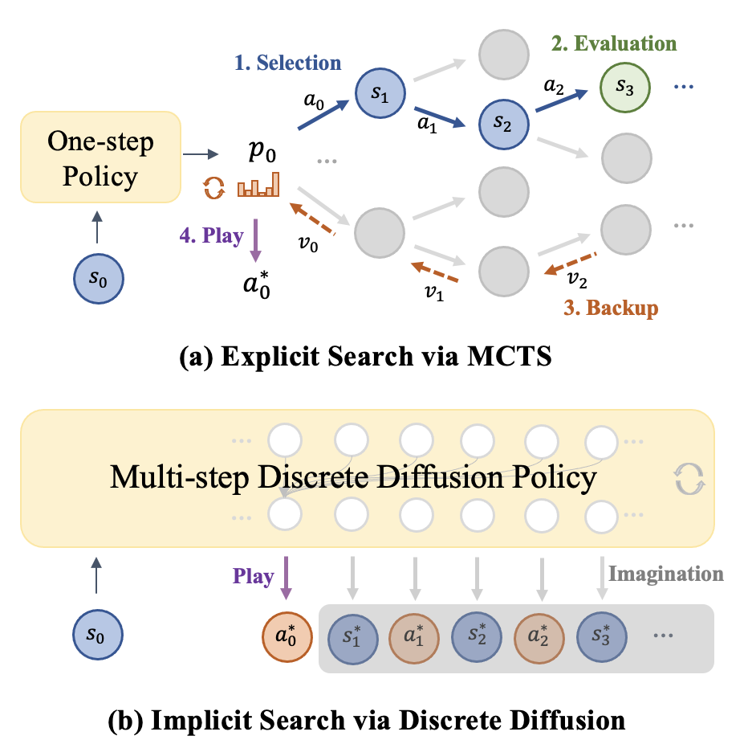
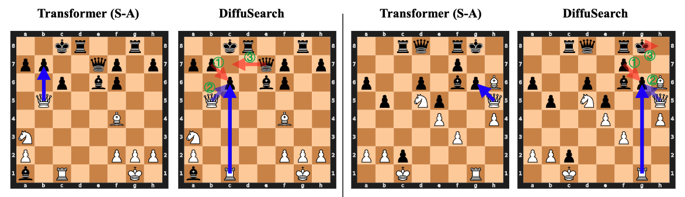
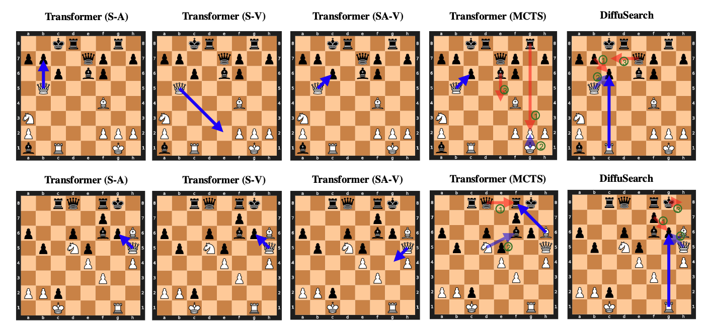

# Implicit Search via Discrete Diffusion: A Study on Chess

This repository contains code for training and evaluating the models in the paper "[Implicit Search via Discrete Diffusion: A Study on Chess](https://arxiv.org/abs/2502.19805)".

TLDR: 
- We proposes DiffuSearch, a novel method to enhance the planning abilities of Large Language Models without relying on explicit search methods such as MCTS. 
- By leveraging discrete diffusion modeling, DiffuSearch enables implicit search through future state prediction, demonstrated in the domain of chess. 
- Our experiments reveal DiffuSearch outperforms both searchless policies and explicit search-enhanced policies in action accuracy and Elo ratings.

<p align = "center">

</p>
<p align = "center">
Comparison between explicit search via MCTS and implicit search via discrete diffusion. MCTS explicitly performs action selection, state evaluation, and value backup in an iterative manner before determining the next action to take, while discrete diffusion implicitly gathers future information during future imagination to improve the next action prediction.
</p>


While our primary research focus isn't on developing a top-performing chess engine, we do host DiffuSearch (trained on 100k games) on lichess: https://lichess.org/@/diffusearchv0 as a side project for anyone interested in playing with it :)
It can easily defeat a beginner like me, but is still weaker than the current state of the art chess programs like [Lc0](https://lczero.org/) or [Stockfish](https://stockfishchess.org/). We expect more training data will further boost DiffuSearch's chess-playing ability.

## Setup
All required packages can be found in `requirements.txt`. You can install them in a new environment with
```
conda create -n diffusearch python=3.9
conda activate diffusearch

pip install -r requirements.txt -f https://download.pytorch.org/whl/torch_stable.html
```

## Resource
We provide 10k training games (~656k records) and 1k test games (~62k records) at `data.zip`. Unzip it and place it at `./data`. More data and checkpoints will be provided soon.

## Usage

Here is a few training and evaluation commands for people who want to train a chess agent. If you just want to play with DiffuSearch, you can skip this part and directly go to https://lichess.org/@/diffusearchv0 and register an lichess account to start a game.

```
# train and eval DiffuSearch
bash scripts/train-ddm-s_asa.sh
```

# Cases
<p align = "center">

</p>
<p align = "center">
In the left puzzle, DiffuSearch sacrifices the rook to set up a long-term
checkmate situation against the opponent. This maneuver compels the opponent to defend and
creates an opportunity to capture the queen, facilitating valuable piece exchanges.
In the right puzzle, DiffuSearch anticipates an exchange sacrifice, correctly valuing the long-term positional benefits of opening lines by sacrificing the rook for its queen. 
</p>

<p align = "center">

</p>
More cases can be found in the paper.

# Citation
If you find our code or data helpful, please cite us as follows:
```
@article{ye2025implicit,
  title={Implicit Search via Discrete Diffusion: A Study on Chess},
  author={Ye, Jiacheng and Wu, Zhenyu and Gao, Jiahui and Wu, Zhiyong and Jiang, Xin and Li, Zhenguo and Kong, Lingpeng},
  journal={arXiv preprint arXiv:2502.19805},
  year={2025}
}
```